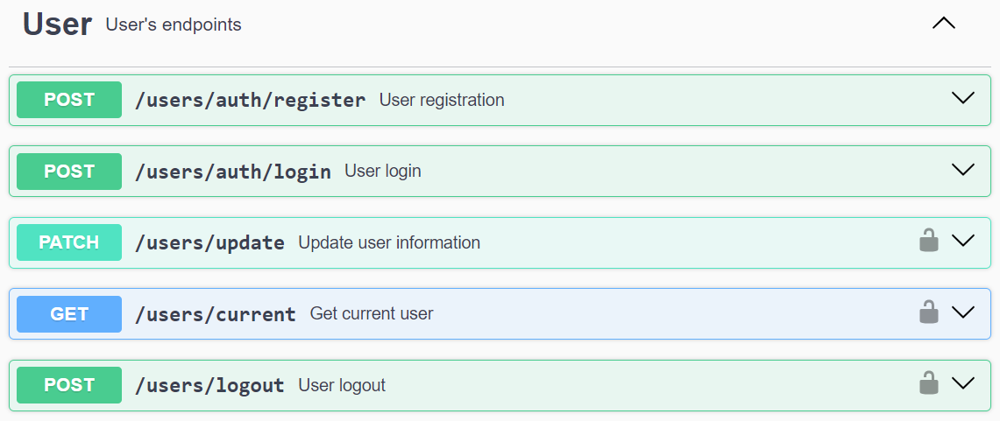
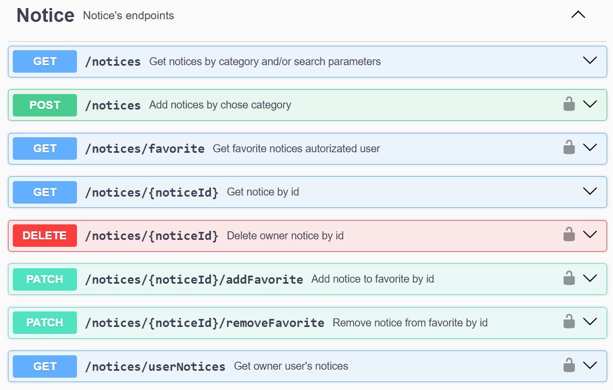
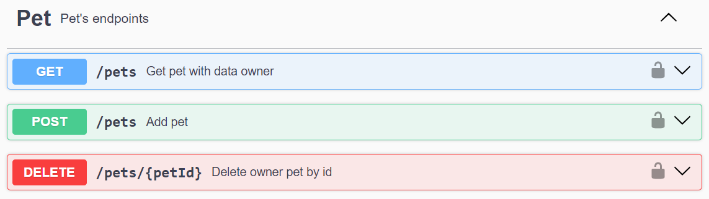
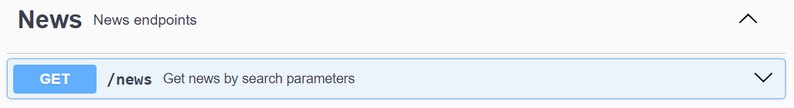
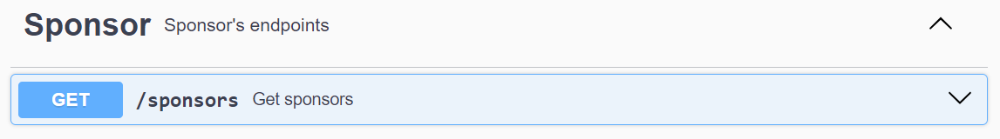

# Your pet API

## Project Overview

This project implements the server-side component of the Your Pet application. It is built on Node.js, utilizing the Express.js framework to implement the API and Mongoose for interacting with the MongoDB database.

## Technologies Used

Here are some of the key technologies and libraries used in this project:

 -  -  -  -  -  -  -  -  -  -  -  -  -  -  -  - 

## API documentation

For detailed descriptions of API requests and interactions, refer to the: [`Your pet documentation`](https://your-pet-shw3.onrender.com/api-docs/)

**User's endpoints**

**Notice's endpoints**

**Pet's endpoints**

**News endpoints**

**Sponsor's endpoints**

## Requirements

Before getting started with the project, make sure you have the following tools installed on your computer:

- `Node.js` (version 12 or higher)

## Installation

1. Clone this repository to your local computer.
2. Open the terminal and navigate to the root folder of the project.
3. Run the command `npm install` to install project dependencies.

## Configuration

1. Create a .env file in the project's root folder, based on the .env.example file.
2. Specify the necessary environment variables in this file.

## Server Commands

**npm:**

- `npm start` — Start the server in production mode.
- `npm run dev` — Start the server in development mode.
- `npm run lint` — Run code linting using eslint. Perform this before each PR and fix all linting errors.
- `npm run lint:fix` — Similar to lint command, but automatically fixes simple linting errors.
